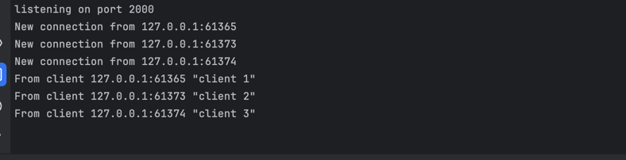
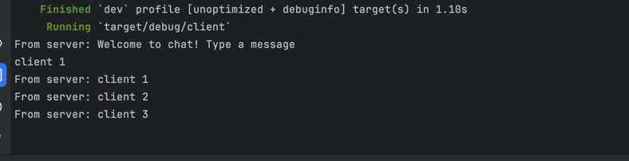
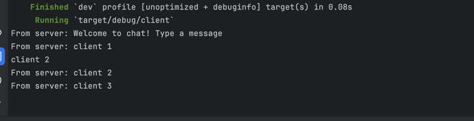
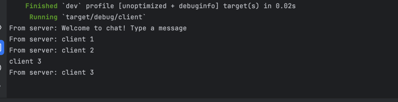
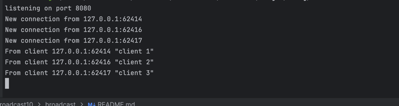
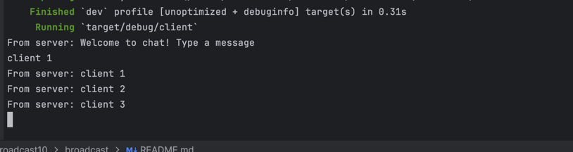
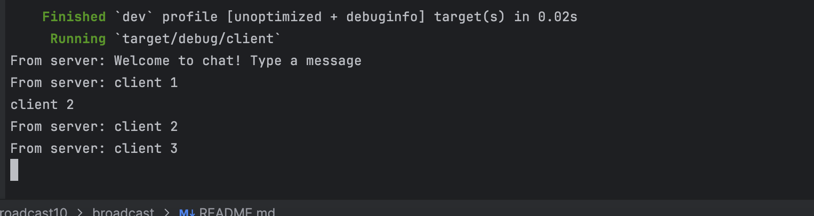
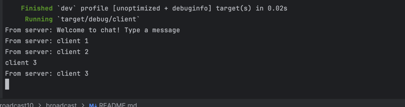

### Tutorial 2.1: Broadcast Chat — Results and Explanation

In this tutorial, I implemented a WebSocket-based broadcast chat system in Rust using `tokio` and `tokio-websockets`. I wrote two binaries: one for the server and one for the client. The server listens on TCP port 2000 and uses a broadcast channel to forward incoming messages to all connected clients.

To test the setup, I ran the server and then launched three separate client instances in different terminals. Each client connected successfully and was able to send and receive messages. When I typed a message in one client, it was broadcast and displayed in all clients, including the sender.

This confirmed that the server correctly receives and rebroadcasts messages using asynchronous tasks. The WebSocket streams handled input and output concurrently, and the broadcast channel ensured all clients received every message.

Here’s what I saw from one of the clients:

### Tutorial 2.2: Modifying the WebSocket Port

I modified the WebSocket port from `2000` to `8080` to better simulate a real-world production environment where port `8080` is more commonly used. To do this, I updated both the client and server so that they would communicate over the same port.

In the server (`server.rs`), I changed the `TcpListener` to bind on `"127.0.0.1:8080"`. On the client side (`client.rs`), I updated the URI passed to `ClientBuilder::from_uri()` to `"ws://127.0.0.1:8080"`.

After making these changes, I ran the server and then launched three clients. Everything worked as expected: the server accepted connections on port 8080, and all messages sent by one client were received by all others. This shows that the WebSocket protocol (`ws://`) still works the same as long as both sides agree on the port.

The WebSocket protocol is defined by the URI string in the client and the TCP bind address in the server.

